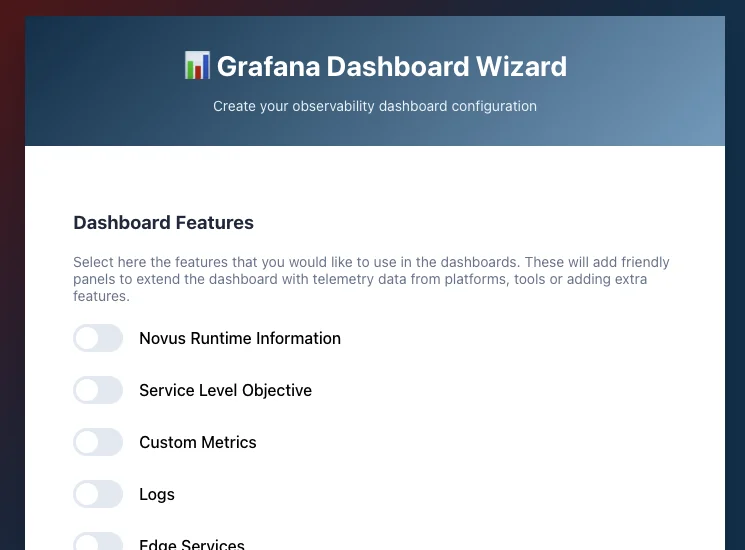
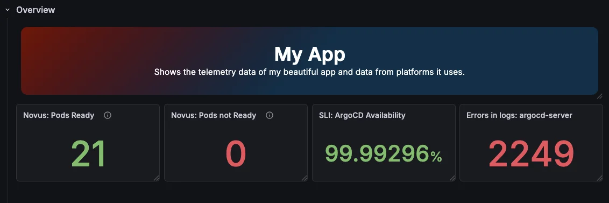
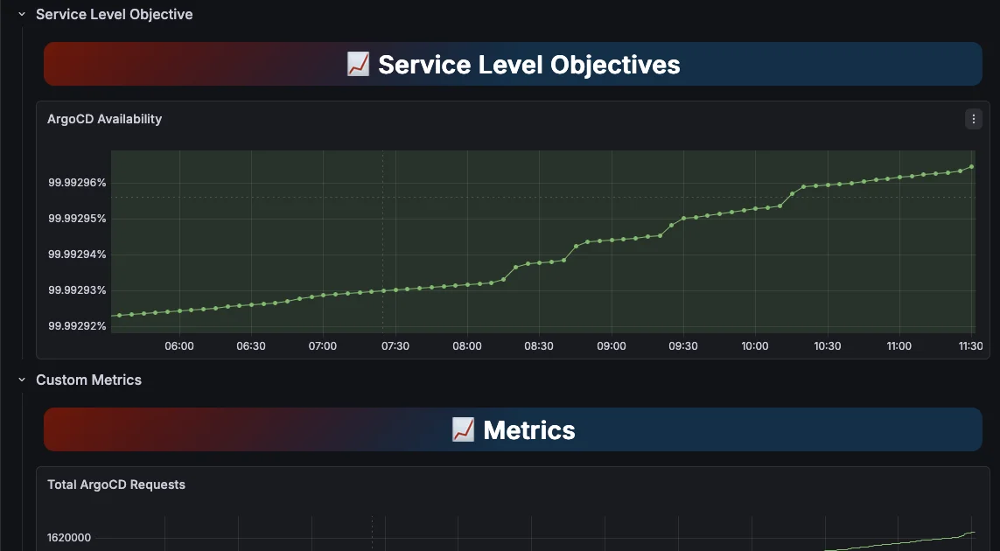

# Adding a new Feature in the Dashboard Framework

This guide walks you through creating a new features (or integration) for the
Dashboard Framework wizard. The Features are forms / React components that ask
questions and generate Grafana Panels using the
[Grafana Foundation SDK](https://grafana.com/docs/grafana/latest/as-code/observability-as-code/foundation-sdk/).

When creating a new feature, remember to use user's input to understand what the
user goal is. For example: when possible instead of asking a specific metric,
create forms what the user would like to see.

### What is a Feature?

A feature is a self-contained React component that lives in `src/features/`.
When a user enables a feature in the wizard, the framework adds it as a
dedicated step between "Feature Selection" and the final "Output" step. The
feature collects whatever configuration it needs, then hands off a set of
**Grafana panels** and **dashboard variables** to the framework.

The framework then assembles everything into a single Grafana dashboard JSON:
a shared **Overview row** (small stat panels from all features) at the top,
followed by one dedicated section per enabled feature with more insights.



### Example Feature

Create a new file at `src/features/my-platform.tsx`. Every feature file
must export exactly three things: `FeatureID`, `FeatureName` and `Component`.

`FeatureIcon` is optional and can be set as a URL for a small icon or as
text/emoji to display as an icon.

Here is an example feature to start:

```typescript
// Code for src/features/my-platform.tsx

import {
  PanelBuilder as TextPanelBuilder,
  TextMode
} from '@grafana/grafana-foundation-sdk/text';

import { usePersistentState } from "../lib/usePersistentState.ts";

// Required constants
export const FeatureID = "my-platform";    // unique lowercase slug
export const FeatureName = "My Platform";  // display name shown in the wizard
export const FeatureIcon = "";             // Either URL or text to display as icon, can be emoji!

// The component that will be used when enabled to display the form
export function Component({ goBack, goForward, setDashboardPanels }) {
  // usePersistentState saves data across refresh and navigation
  const [formData, setFormData] = usePersistentState("feat_myplatform_formData", {
    text: "",
  });

  const onSubmit = () => {
    // Create panels to add to the dashboard
    const panels = [
      new TextPanelBuilder()
      .title("")
      .transparent(true)
      .mode(TextMode.HTML)
      .span(24)
      .height(2)
      .content(`
        <div style="display: flex; height:100%; background: linear-gradient(135deg, #780000 0%, #003049 50%); color: white; border-radius: 12px; align-items: center; text-align: center;">
          <div style="width: 100%;">
            <h2 style="margin: 0; font-size: 2em; font-weight: 700;">
              My Platform: ${formData.text}
            </h2>
          </div>
        </div>
      `)
    ];
    
    setDashboardPanels(FeatureID, [], panels);
    goForward();
  };

  return (
    <>
      <div className="wizard-content">
        <h3 style={{ marginBottom: "20px", color: "#1e293b" }}>My Platform</h3>
        <p style={{ color: "#64748b", marginBottom: "20px", fontSize: "14px" }}>
          Add Useful information from My Platform to your dashboard.
        </p>

        <div className="form-group">
          <label className="form-label">What text would be useful to the user?</label>
          <input
            type="text"
            placeholder="eg: explain how you use My Platform"
            value={formData.text}
            onChange={(e) => setFormData({...formData, text: e.target.value})}
          />
          <div className="form-hint">This will be used to display useful info in the dashboard</div>
        </div>
      </div>

      <div className="wizard-footer">
        {goBack && <button className="btn btn-secondary" onClick={goBack}>
          ← Previous
        </button>}
        {goForward && <button className="btn btn-primary" onClick={onSubmit}>
          Next →
        </button>}
      </div>
    </>
  )
}
```

`FeatureID` is used internally as a stable key: once dashboards are generated
with it, avoid renaming it. `FeatureName` is what the user sees in the feature
selection screen and as the row title in the final dashboard.


### Understand the Component props

Your `Component` function receives three props from the wizard framework:

```typescript
export function Component({ goBack, goForward, setDashboardPanels }
```

#### `goBack`

Navigates the wizard to the previous step. The framework passes `null` when
there is no previous step, so always guard before calling it:

```typescript
{goBack && <Button onClick={goBack}>← Previous</Button>}
```

#### `goForward`

Navigates the wizard to the next step (or the Output step if this is the
last feature). Like `goBack`, it can be `null`.

**Do not call `goForward` directly**. Instead, call it from a function like
`onSubmit` after you have called `setDashboardPanels` to make sure that the
data is carried over and saved:

```typescript
// Use onSubmit if you need to
const onSubmit = () => {
  if (!validate()) return;
  setDashboardPanels(FeatureID, genOverviewPanels(), genPanels(), genVariables());
  goForward?.();
};
```

#### `setDashboardPanels`

This is the primary way your feature contributes to the dashboard. Call it once, just before navigating forward.

| Argument | Type | Purpose |
|---|---|---|
| `featureId` | `string` | Always pass `FeatureID`. Used to associate panels with this feature. |
| `overviewPanels` | `PanelBuilder[]` | Small stat/summary panels shown in the shared **Overview row** at the top of the dashboard. Ideal for things like "pods running", "queue depth", or "error rate". |
| `panels` | `PanelBuilder[]` | Full-size panels placed in a dedicated **feature row** below the overview. These are your detailed time-series charts, logs panels, banners, etc. |
| `variables` | `VariableBuilder[]` (optional) | Dashboard variables (like `$namespace` or `$cluster`) that your panel queries reference. Injected into the dashboard-level variable list. |


### Collect user input with persistent state

Use `usePersistentState` instead of plain `useState` so user input survives
navigation (going back and forward through wizard steps without losing data):

```typescript
import { usePersistentState } from "../lib/usePersistentState";

// Inside the Component
const [formData, setFormData] = usePersistentState("feat_myplatform_formData", {
  cluster: "",
});
```

The first argument is a `localStorage` key: use a consistent prefix like
`feat_<id>_` to avoid collisions with other features.


### Build your panels

Panels are built using the `@grafana/grafana-foundation-sdk` builder API.
All panel builders live under `@grafana/grafana-foundation-sdk/dist/cjs/`.

There are two different kind of Panels you can add, the Overview Panels and
Detailed Panels.

#### Overview panels (small summary stats)

These should be compact and quick to read. Add these if you want to signal
instantly of a problem to the user. Usually a single overview panel is enough
to not overcrowd the dashboard. This will be the first thing the users will
check. Think: _what would the user like to see to know if everything is fine
with my platform?_

These panels are usually small, with a maximum span and height of 4. Bigger
panels should go in the Feature Row.

 

A `StatsPanelBuilder` is a common choice:

```typescript
import { stat } from "@grafana/grafana-foundation-sdk/dist/cjs/stat";
import { prometheus } from "@grafana/grafana-foundation-sdk/dist/cjs/prometheus";


// In the React Component
const genOverviewPanels = () => [
  new stat.PanelBuilder()
    .title("My Platform: Active Items")
    .height(4)
    .span(4)
    .withTarget(
      new prometheus.DataqueryBuilder()
        .datasource({ uid: "$my_platform_datasource" })
        .expr(`count(my_metric{cluster="${formData.cluster}"})`)
        .instant()
    ),
];
```

#### Detailed panels (feature row)

These are the main visualizations. Used for deep dive, better understanding
of the state. Think: _what would the user like to see to know in deetails
if and what is wrong with my platform or the way they use it?_



Time-series panels are typical:

```typescript
import { timeseries } from "@grafana/grafana-foundation-sdk/dist/cjs/timeseries";
import { prometheus } from "@grafana/grafana-foundation-sdk/dist/cjs/prometheus";

// In the React Component
const genPanels = () => [
  new timeseries.PanelBuilder()
    .title("My Platform: Item Rate")
    .height(8)
    .span(12)
    .withTarget(
      new prometheus.DataqueryBuilder()
        .datasource({ uid: "$my_platform_datasource" })
        .expr(`rate(my_metric_total{cluster="${formData.cluster}"}[5m])`)
        .legendFormat("{{ instance }}")
    ),
];
```

> [!hint]
> `span` controls the Grafana grid width out of 24. Use `span(12)` for half-width
> and `span(24)` for full-width panels.

#### Dashboard variables

If your panel queries use template variables (like `$my_platform_datasource`),
declare them here so they appear in the Grafana dashboard's variable list:

```typescript
import { ConstantVariableBuilder } from "@grafana/grafana-foundation-sdk/dist/cjs/dashboard";

// In the react Component
const genVariables = () => [
  new ConstantVariableBuilder("my_platform_datasource")
    .label("My Platform: datasource")
    .value("12341231231231"),
];
```

### Render the form

Structure your component's JSX with `wizard-content` for the form body and
`wizard-footer` for the navigation buttons. This keeps the layout consistent
with other steps:

```typescript
return (
  <>
    <div className="wizard-content">
      <h3 style={{ marginBottom: "20px", color: "#1e293b" }}>My Platform</h3>
      <p style={{ color: "#64748b", marginBottom: "20px", fontSize: "14px" }}>
        Add Useful information from My Platform to your dashboard.
      </p>

      <div className="form-group">
        <label className="form-label">What text would be useful to the user?</label>
        <input
          type="text"
          placeholder="eg: explain how you use My Platform"
          value={formData.text}
          onChange={(e) => setFormData({...formData, text: e.target.value})}
        />
        <div className="form-hint">This will be used to display useful info in the dashboard</div>
      </div>
    </div>

    <div className="wizard-footer">
      {goBack && <button className="btn btn-secondary" onClick={goBack}>
        ← Previous
      </button>}
      {goForward && <button className="btn btn-primary" onClick={onSubmit}>
        Next →
      </button>}
    </div>
  </>
);
```

UI components like `AutoComplete`, `Button`, `InputText`, and `Dropdown` come
from [PrimeReact](https://primereact.org/), which is already a dependency.


### Add the feature in the Wizard

Open `src/Wizard.tsx` and add your import and entry to the `FEATURES` array:

```typescript
// Add your import alongside the others
import * as FeatureMyIntegration from "./features/my-integration.tsx";

// Add to the FEATURES array (order determines wizard step order)
const FEATURES = [
  FeatureSLO,
  FeatureMetrics,
  FeatureLogs,
  FeatureMyIntegration, // <-- add here
];
```

The wizard automatically picks up the new entry: it appears in the feature
selection screen using `FeatureName`, and becomes a new wizard step when
the user enables it.
